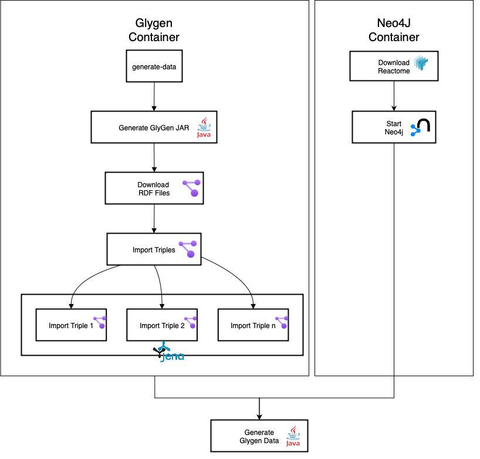

# Glygen Data Generation


## TLDR;


**Make sure the docker service is running before execute this pipeline.**


Clone the repository
1. `git clone https://github.com/glygener/glygen-data-pipeline.git`
2. `cd glygen-data-pipeline`
3. `./run.sh generate-data`

---

- [Glygen Data Generation](#glygen-data-generation)
  - [TLDR;](#tldr)
    - [Makefile Generation](#makefile-generation)
  - [Description](#description)
  - [Why Makefile?](#why-makefile)
  - [Dependencies](#dependencies)
  - [Configuration](#configuration)
  - [Workflow Overview](#workflow-overview)
  - [Makefile Goals Explanation](#makefile-goals-explanation)
    - [1. **generate-glygenjar**](#1-generate-glygenjar)
    - [2. **download-files**](#2-download-files)
    - [3. **import-triplets**](#3-import-triplets)
    - [4. **setup-reactome**](#4-setup-reactome)
    - [5. **generate-data**](#5-generate-data)
    - [6. **generate-other-data**](#6-generate-other-data)
    - [7. **all**](#7-all)
    - [8. **clean**](#8-clean)
  - [Goals Execution](#goals-execution)
  - [Glygen YAML Configuration Properties:](#glygen-yaml-configuration-properties)
    - [Configuration Section](#configuration-section)
    - [Data Section](#data-section)
  - [EPITOPE Data Generation](#epitope-data-generation)
  - [COSMIC Data Generation](#cosmic-data-generation)
  - [Troubleshooting](#troubleshooting)


### Makefile Generation

In case of need to regenerate Makefile, adjust the configurations as you need in `glygen.yaml` file and run:

```bash
./run.sh j2 Makefile.j2 glygen.yaml > Makefile
```

## Description

This project utilizes a Makefile to manage various tasks related to data generation and setup. Below is an overview of the main targets and their dependencies.

## Why Makefile?

Using a Makefile pipeline offers automation, efficiency, flexibility, and simplified project management. It automates tasks and reduces unnecessary computations.


## Dependencies
To use this Makefile, ensure you have the necessary dependencies installed:
- Docker

## Configuration
Ensure that the configuration variables in the Makefile filled by `glygen.yaml` are correctly set before running any targets.


## Workflow Overview
<center>



</center>

## Makefile Goals Explanation

### 1. **generate-glygenjar**
This target builds the Glygen JAR using Maven. It depends on the Glygen JAR file.


### 2. **download-files**

This Makefile target is responsible for downloading files using the GlyGen tool. Depends the `$(GLYGEN_DIRECTORY)/target/$(GLYGEN_JAR)`: Specifies the required JAR file for the GlyGen tool.

### 3. **import-triplets**
Depends on the successful generation of the Glygen JAR and the presence of specific RDF files. It downloads and imports triplets.

### 4. **setup-reactome**
Download Reactome graph database (it will be loaded into Neo4J)


### 5. **generate-data**
Depends on all previous setups and generates data using the Glygen JAR.

### 6. **generate-other-data**
Depends on all previous setups and generates data using the Glygen JAR. It generates the other data required for glygen data release

### 7. **all**

The `all` target sequentially invokes the following commands using required for the glygen data generation:

### 8. **clean**
Removes generated files and directories.

## Goals Execution

- `make generate-glygenjar`: Builds the Glygen JAR.
- `make download-files`: Download RDF files.
- `make import-triplets`: Imports triplets.
- `make setup-reactome`: Download Reactome Data and copy it to Neo4J.
- `make generate-data`: Generates data.
- `make generate-other-data`: Generates other data required to glygen data release.
- `make all`: Encapsulate all required steps.
- `make clean`: Cleans up generated files.


## Glygen YAML Configuration Properties:

### Configuration Section
  - `glygen_directory:` Sets Glygen path. It must points out where Glygen Java code base is located (Default `./glygen`).

  - `input_directory:` This is a directory where Glygen will consume input files. Must be set as the value set in `glygen_directory` + `/in`,
  e.g. `./glygen/in` (Default `glygen/in`).

  - `output_directory:` Folder that will be created to store generated files. (Default `./releases`)

  - `release_date:` "This property will be concatenated with `output_directory` e.g. 2025_06 will result in a folder `./releases/2025_06`"

  - `glygen_jar:` "Glygen JAR name (Default `glygen-2024.6-SNAPSHOT.jar`)"

  - `reactome_directory:` Directory where reactome will be downloaded and extracted (Default `./reactome`).

  - `java_xms:` Java heap size for JVM (Default `4g`)

  - `java_xmx:` Java heap size for JVM (Default `16g`)

### Data Section
`data:`
  `triplets:` List of triplets that Glygen will use for generating data. Each triplet should be in RDF format. These files will be considered as dependencies during the `download-files` Makefile goal.


## EPITOPE Data Generation
After the release is complete, you can generate the epitope data using the `scripts/epitope.py` file.
Simply call the script using the provided wrapper shell script, passing the release folder as the argument. In this case, the release folder is `releases/2025_06/`.

```bash
./run.sh python3 scripts/epitope.py releases/2025_06/
```

The epitope TSV files output will be generated in `releases/2025_06/epitope`


## COSMIC Data Generation
After the release is complete, you can generate the epitope data using the `scripts/cosmic.py` file.
Simply call the script using the provided wrapper shell script, passing the release folder as the argument. In this case, the release folder is `releases/2025_06/`.

You can also pass `force` flag to force download and parsing process

```bash
./run.sh python3 scripts/cosmic.py releases/2025_06/cosmic
```

The COSMIC TSV files output will be generated in `releases/2025_06/cosmic`


## Troubleshooting

### Dependency not found (Rebuild Container)

If any python dependency is missing, try to rebuild the docker container just typing:

```bash
docker compose build glygen
```

### Out-of memory error (Killed):
1. If you data generation proccess is being killed, maybe you need to raise java memory limits take a look in `java_xms` and `java_xmx` in the `glygen.yaml` file.
2. Don't forget to regenerate Makefile using `./run.sh j2 Makefile.j2 glygen.yaml > Makefile` after adjusting memory limits.

---

Step by step run:

If data-generation process fails, try to execute the steps one-by-one to identify the issue.

1. Make sure docker daemon is running
2. Remove previous docker services using `docker compose down -v`
3. Rebuild docker services with `docker-compose up -d --build`
4. Check if the `Makefile` is well generated and placed correctly.
5. Remove any previous downloaded content `./run.sh make clean`
6. Type `./run.sh make all` or `./generate-data.sh`.
